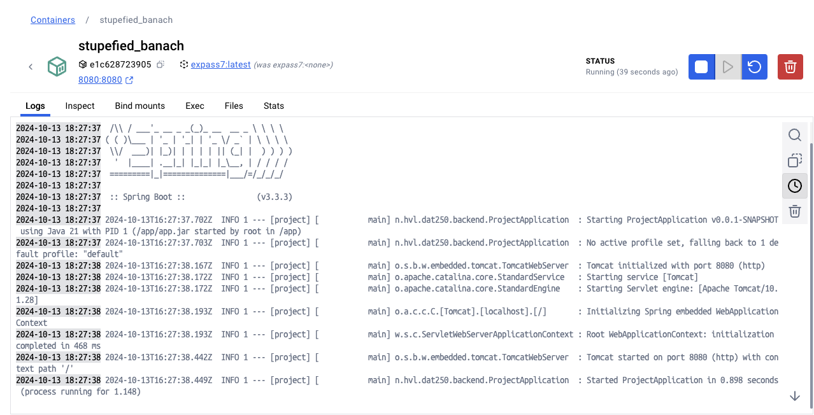

# DAT250 expass 7 hand in Andreas Øihaugen 
This is a handin for DAT250 expass 7

## Using PostgreSQL docker image.

### Setup

First i downloaded the PfostgreSQL image for docker.  
Then i tried to use the provided code:  
 ``` 
 docker run -p {{ Find out what Port you have to expose... }} \  
-e {{ Find out what environment variables you have to set... }} \
 -d --name my-postgres --rm postgres 
 ``` 
 
As PostgreSQL runs on port `5432` I fugured this was the port i had to expose and by reading the documentation i found that the image required `POSTGRES_PASSWORD` as input.

### Using the image

 I used the code from expass 4 to implement the database. I used DBeaver to connect to the database and create the `jpa_client` user. I then changed over the hibarnate options as required by the guide and as the guide expected my tasks failed. I then wanted to try to auto generate the databasecontext by using the autogenerated schema.up.sql and adding it to the `/docker-entrypoint-initdb.d/` directory. I ended up using some time figuring out how exactly to copy the file to the correct location on creation of the container.

After a while I ended up with this command:
 ```
 docker create --name some-postgres \
  -v /Users/andreasoihaugen/IdeaProjects/dat250-jpa-tutorial/schema.up.sql:/docker-entrypoint-initdb.d/schema.up.sql \
  -e POSTGRES_PASSWORD=mysecretpassword \
  -p 5432:5432 \
  postgres
```

After creating container using the command above I created the `jpa_client` again and the test then passed.

This concluded the first part of the expass.

## Building my own dockerized application

### Setup 
I desided to use the expass 2 code for this part of the experiment. 
I decided to use the official gradle image and downloaded this using `docker pull gradle`.
After downloading the image i created a <mark> Dockerfile</mark> and wrote the following code:

```
FROM gradle:jdk21 as build

WORKDIR /home/gradle/project

COPY --chown=gradle:gradle . /home/gradle/project

RUN gradle bootJar

FROM openjdk:21-jdk-slim

WORKDIR /app

COPY --from=build /home/gradle/project/build/libs/*.jar /app/app.jar

CMD ["java", "-jar", "/app/app.jar"]

EXPOSE 8080
```

I then used the following commands inside the project where i also saved the <mark>Dockerfile</mark>:

`docker build -t expass7 .` and `docker run -p 8080:8080 expass7`


This created a gradle container running the jar file created by bootJar.
